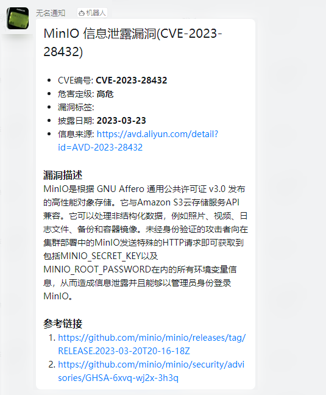

# WatchVuln 高价值漏洞采集与推送

众所周知，CVE 漏洞库中 99% 以上的漏洞只是无现实意义的编号。我想集中精力看下当下需要关注的高价值漏洞有哪些，而不是被各类 RSS
和公众号的 ~~威胁情报~~ 淹没。 于是写了这个小项目来抓取部分高质量的漏洞信息源然后做推送。 `WatchVuln`意为**监测**
漏洞更新，同时也表示这些漏洞需要**注意**
漏洞更新，同时也表示这些漏洞需要**注意**一下。

当前抓取了这几个站点的数据：

| 名称           | 地址                                    | 推送策略                                             |
|--------------|---------------------------------------|--------------------------------------------------|
| 阿里云漏洞库       | https://avd.aliyun.com/high-risk/list | 等级为高危或严重                                         |
| OSCS 开源安全情报预警 | https://www.oscs1024.com/cm           | 等级为高危严重**或者**包含 `预警` 标签                          |
| 奇安信威胁情报中心    | https://ti.qianxin.com/vulnerability  | 等级为高危严重**并且**包含 `奇安信CERT验证` `POC公开` `技术细节公布`标签之一 |

> 所有站点采用的都是公开接口，且抓取策略很柔和，无恶意。如果有侵权，请提交 issue, 我会删除相关源。
>
> 如果有更好的信息源也可以反馈给我，需要能够响应及时 & 漏洞有价值

当有漏洞更新时，会受到一条推送消息：



## 快速使用

### 使用 Docker

使用之前需要先添加机器人，获取相关的密钥，当前支持钉钉和企业微信 （飞书在路上了） 几个相关的环境变量：

- `DINGDING_ACCESS_TOKEN` 钉钉 webhook 的 `access_token` 部分，形如 `260cdz724fay862bce8d3ea71762cxxxxxxxxx`
- `DINGDING_SECRET` 钉钉加签的那个值，形如 `SECxxxxxxxxxxxxxxxxxx`
- `WECHATWORK_KEY` 企业微信 webhook 的 key , 形如 `260cdz724fay862bce8d3ea71762cxxxxxxxxx`

使用钉钉机器人

```bash
docker pull zemal/watchvuln:latest

docker run --restart always -d \
  -e DINGDING_ACCESS_TOKEN=xxxx \
  -e DINGDING_SECRET=xxxx \
  -e INTERVAL=30m \
  zemal/watchvuln:latest
```

使用企业微信机器人

```bash
docker pull zemal/watchvuln:latest

docker run --restart always -d \
  -e WECHATWORK_KEY=xxxx \
  -e INTERVAL=30m \
  zemal/watchvuln:latest
```

如果配置了多种机器人的密钥，都会生效，也就是说可以在一个服务推送到多种服务。 初次运行会在本地建立全量数据库，大概需要 1~5
分钟，可以使用 `docker logs -f [containerId]` 来查看进度。
完成后会在群内收到一个提示消息，表示已成功跑起来。 后续将每 30 分钟 (30m) 检查一次。这个频率可以通过 `INTERVAL`
这个环境变量来设置，支持的形式如
`120s` `30m` `1h`，最低 1 分钟 (`60s` 或 `1m`)

### 使用二进制

前往 Release 下载对应平台的二进制，然后在命令行执行。

```bash
USAGE:
   watchvuln [global options] command [command options] [arguments...]

VERSION:
   v0.2.0

COMMANDS:
   help, h  Shows a list of commands or help for one command

GLOBAL OPTIONS:
   --debug, -d                                set log level to debug, print more details (default: false)
   --interval value, -i value                 checking every [interval], supported format like 30s, 30m, 1h (default: "30m")
   --dingding-access-token value, --dt value  access token of dingding bot
   --dingding-sign-secret value, --ds value   sign secret of dingding bot
   --wechatwork-key value, --wk value         wechat work webhook key
   --pusher-api value, --api value  general http api
   --no-start-message, -n                     disable the hello message when server starts (default: false)
   --help, -h                                 show help
   --version, -v                              print the version
```

在参数中指定相关 Token 即可

钉钉

```
$ ./watchvuln --dt DINGDING_ACCESS_TOKEN --ds DINGDING_SECRET -i 30m
```

企业微信

```
$ ./watchvuln --wk WECHATWORK_KEY -i 30m
```

通用 WEB API

```
$ ./watchvuln --api PUSHER_API -i 30m
```

```json
{"title": "XXX漏洞", "content": "XXX详情"}
```

## 常见问题

1. 服务重启后支持增量更新吗

   支持，数据会保存在运行目录的 `vuln_vx.sqlite3` 中，这是一个 sqlite3 的数据库，服务重启后将按照一定的策略去增量抓取。

2. 如何强制重新创建本地数据库

   删除运行目录的 `vuln_vx.sqlite3` 文件再重新运行即可

## 其他

为了减少内卷，该工具在 00:00 到 07:00 间会去 sleep 不会运行，请确保你的服务器是正确的时间！
